# 5184844_B-Chetan
---
# 📘 B Chetan

---

---

## 📚 Overview  
Welcome to my repository! 🚀  
This is a structured record of my **learning journey** across different areas of software development.  

It contains **certificates, exercises, and step-by-step tasks** that highlight my progress.  

---

## 📘 Topics Covered  

- 📘🌱 [SDLC – Week 1](SDLC_week1/README.md)
- 🔧🌿 [Git – Week 2](Git_week2/README.md)
- 🐧💻 [Linux – Week 3](Linux_week3/README.md)
- 💻🧠 [C Programming – Week 4](c-programming_week4/README.md)
- 🎮🚀 [Unity – Week 5](Unity_week5/README.md)

---

✅ **Goal**: To document my skills and strengthen core concepts in software development.  
👤  **Created by**:B Chetan
---

## 🛠 Skills Covered

- Software Development Life Cycle (SDLC)
- Git & GitHub
- Linux Command Line
- C Programming
- Unity Basics

---

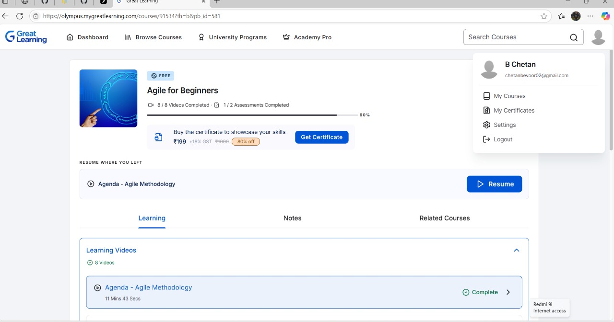
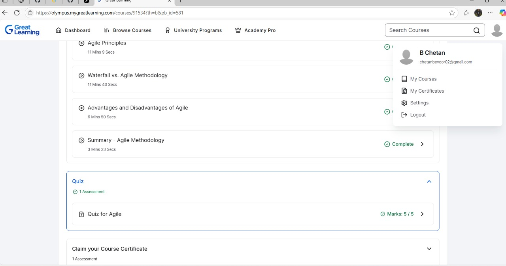
---
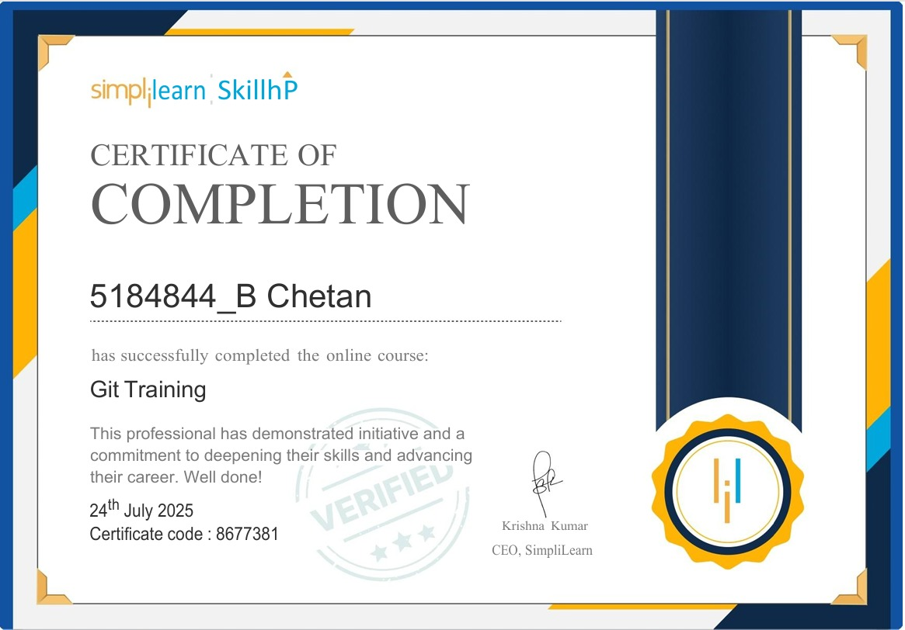
---
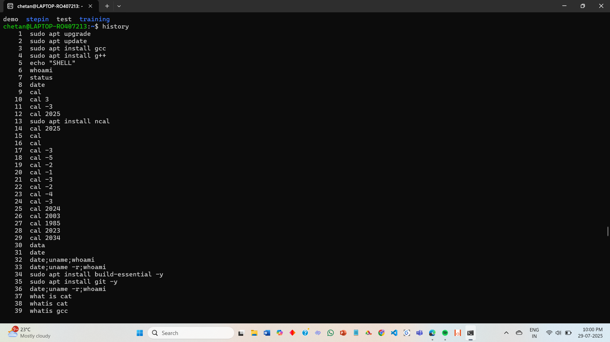
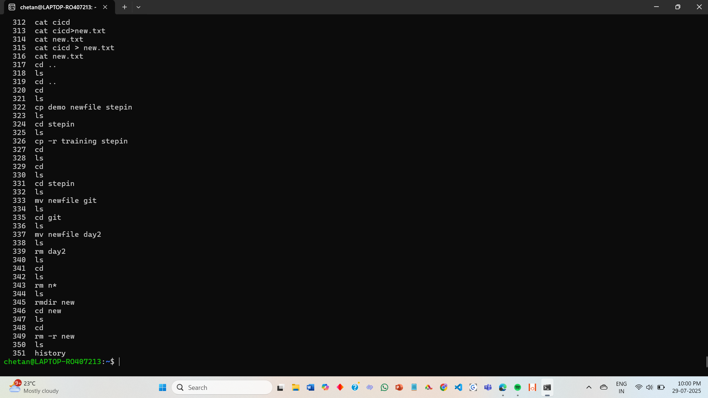
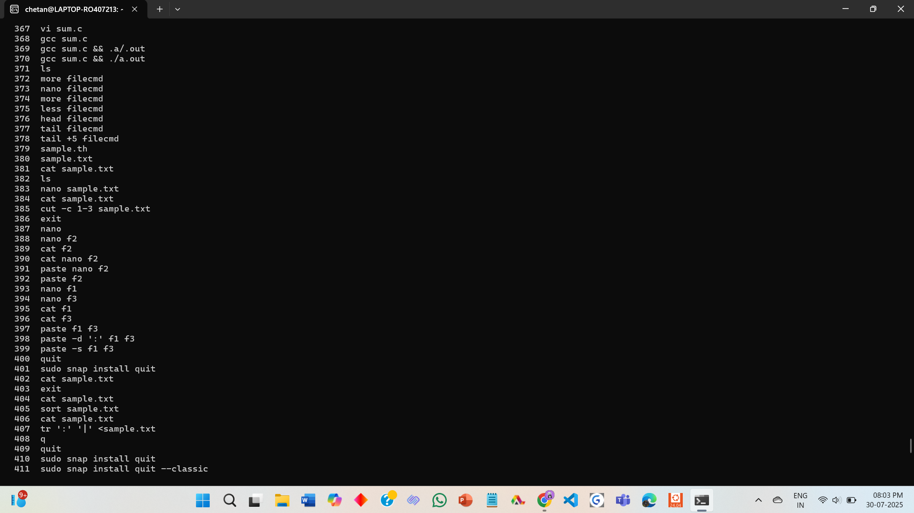
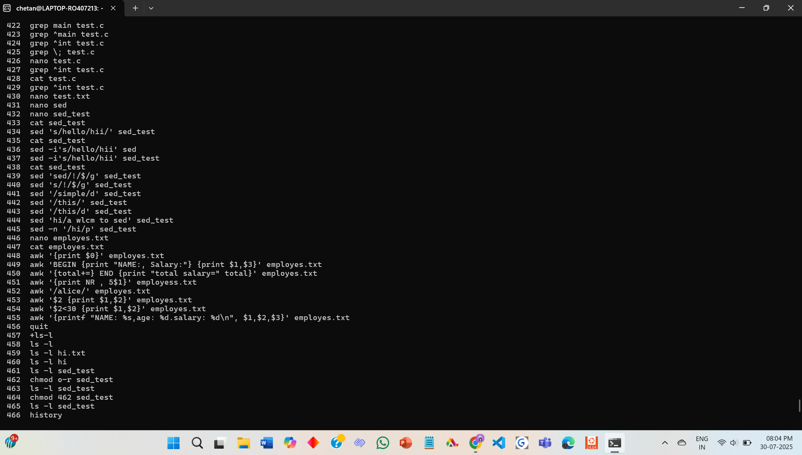
---
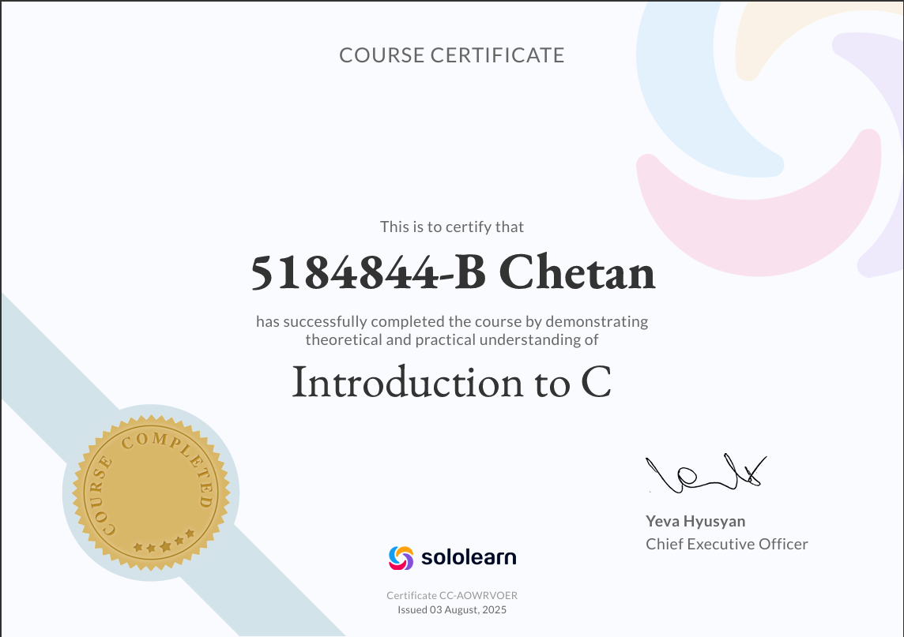
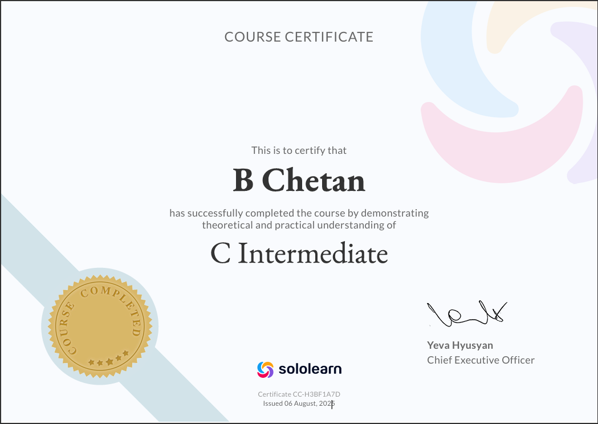
---
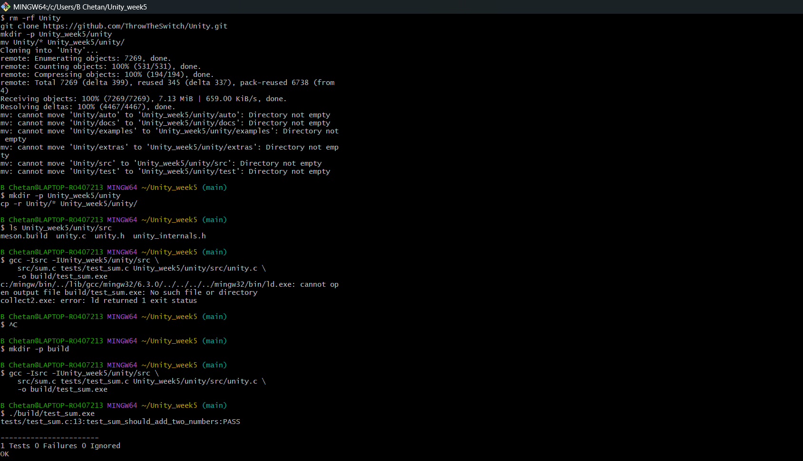
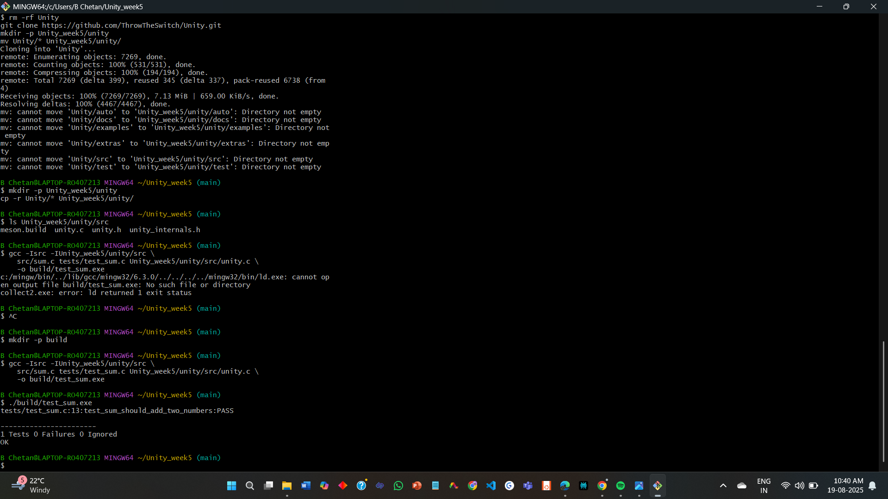
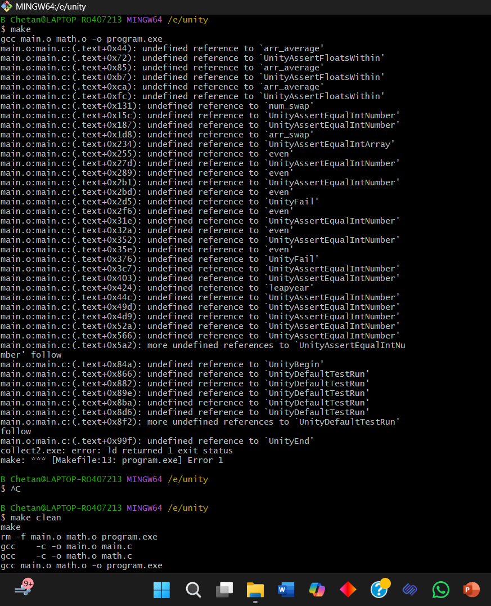

