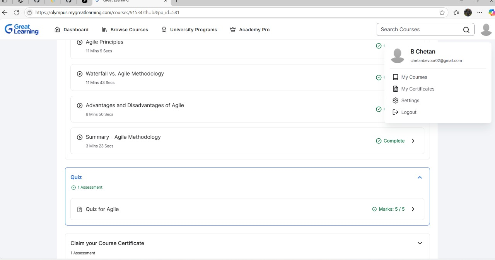
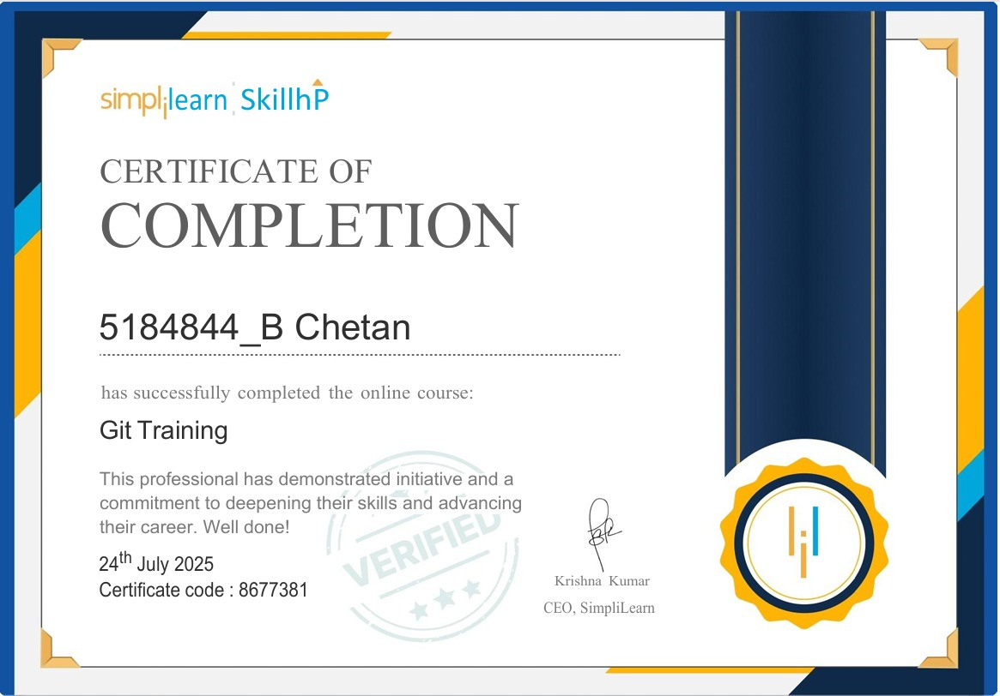
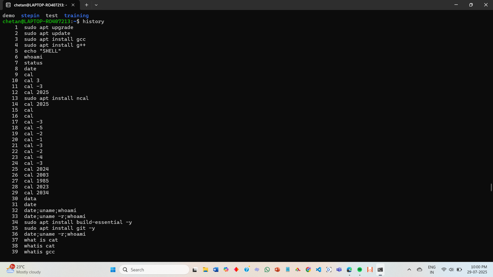
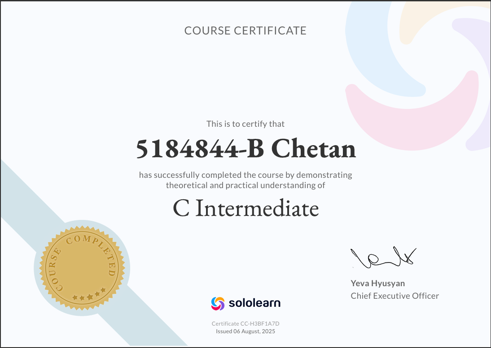

# 5184844_B-Chetan
---

## 📚 Overview  
Welcome to my repository! 🚀  
This is a structured record of my **learning journey** across different areas of software development.  

It contains **certificates, exercises, and step-by-step tasks** that highlight my progress.  

---

## 📘 Topics Covered  

- 🛠️ [SDLC][def]  
- 🌱 [Git & Version Control](GIT/README.md)  
- 🐧 [Linux Command Line](LINUX/README.md)  
- 💻 [C Programming](C/README.md)  
- 🧪 [Unit Testing with Unity Framework](UNITY/README.md)  

---

✅ **Goal**: To document my skills and strengthen core concepts in software development.  
👤 **Created by**: B Chetan  

---

---

---

---

---

[def]: SDLC/README.md